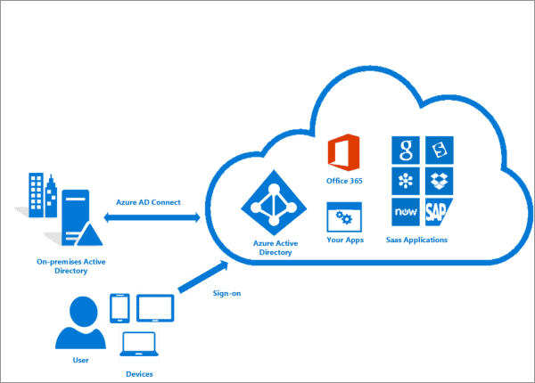

## Resources: 
Resources are instances of services that you create, like virtual machines, storage, or SQL databases.   

## Resource groups: 
Resources are combined into resource groups, which act as a logical container into which Azure resources like web apps, databases, and storage accounts are deployed and managed.   

## Subscriptions: 
A subscription groups together user accounts and the resources that have been created by those user accounts. For each subscription, there are limits or quotas on the amount of resources that you can create and use. Organizations can use subscriptions to manage costs and the resources that are created by users, teams, or projects. 

## Management groups:
These groups help you manage access, policy, and compliance for multiple subscriptions. All subscriptions in a management group management group. automatically inherit the conditions applied to the management Group.

   

## Resource Groups  
`Resources:` are anything you create in an Azure subscription like VMs, Azure Application Gateway instances, and Azure Cosmos DB instances.   
* Resource group is a logical container which help manage and organize your Azure resources.   
For example imilar usage, type, or location   
* Each resource can exist in only one resource group.
* You can move a resource from one resource group to another group.  
* Resource groups can't be nested.   
* The resources in a resource group can be located in different regions than the resource group.   
* Resource group created at location to store metadata.    
* A resource group can be used to scope access control for administrative actions. To manage a resource group, you can assign Azure Policies, Azure roles, or resource locks.  
   * You can apply locks to a resource group or subscription to prevent deletion or make contained resources read-only. You can also apply locks directly to a resource.  
* You can apply tags to a resource group. The resources in the resource group don't inherit those tags.   
* Life cycle: When you delete a resource group, all resources in the resource group are also deleted.   
* To create a resource group, you can use the portal, PowerShell, Azure CLI, or an ARM template.   

 
## AZURE RESOURCE MANAGER(ARM)

Azure Resource Manager is the deployment and management service for Azure. It provides a management layer that enables you to create, update, and delete resources in your Azure account.   
When you send a request through any of the Azure APIs, tools, or SDKs, Resource Manager receives the request. It authenticates and authorizes the request before forwarding it to the appropriate Azure service.      

 

* Atomate resource deployments (create, update, and delete) using templates.   
* ARM template is a JSON file that defines what you want to deploy to Azure.   
* Integrates with Azure portal, PowerShell, CLI, and REST API to perform deployment and management tasks.   
* Easy way to deploy multiple resource instances or reliably redeploy resources.  
* ARM template can be used to deploy the resources consistently and repeatedly.  
* Define the dependencies between resources so they're deployed in the correct order.   

## Subscriptions
* Using Azure requires an Azure subscription.   
* An Azure subscription is a logical unit of Azure services that links to an Azure account. It also allows you to provision resources.   
* A subscription provides you with authenticated and authorized access to Azure products and services.   
* Azure generates separate billing reports and invoices for each subscription.     
* Two types of subscription boundaries.   
   * Billing boundary.  
   * Access control boundary.  
* You can create separate subscription based on:   
   * Environment: development and testing, security, or to isolate data for compliance reasons.    
   * Organizational structures: IT, HR, Admin and so on.  

* Billing: manage and track costs based on your needs, for example - Production, Test and Dev.  

* Different types of Subscription:
	* FREE: An email address and a credit card are required to sign up for a free trial subscription that provides $200 credit for the first 30 days and 12 months of restricted access.   
	* Pay-Per-Use: Charges monthly based on Cloud resource use.   
	* Enterprise: A single Enterprise agreement is established for large subscription purchases, including savings for new licenses and Software Assurance.   
	* Student: This membership includes $100 for 12 months and may be activated without a credit card.   

## Management Groups:

* Management groups let you organize multiple subscriptions as a single management entity to facilitate easier management.   
* You can create managements groups in a hierarchical structure with the top level of the hierarchy at the tenant level and containing all subscriptions in that tenant.   
* Any conditions applied to a management group apply to all subscriptions contained in that management group object.   
* Each management group and subscription can support only one parent.  
* Each management group can have many children.  
* The root management group can't be moved or deleted, unlike other management groups.  

## Windows Active Directory?
Active Directory (AD): Active Directory is a database and a set of services connecting users with the network resources required by them to get their work done. The database (or directory) has critical information related to your IT environment, including what users and computers there are and who’s allowed to do what. The services control most of the activity going on in your IT environment so basically, Windows AD provides authentication and authorization to applications, file services, and other resources in a netwo

## Microsoft Entra ID (Azure Active Directory):
**Microsoft Entra ID**: If we want to manage access to the Azure Cloud application and associated resources then we need Microsoft Entra ID. This helps your employees to access external resources, such as Azure services, Azure portal, And other applications.   

* Helps your employees sign in and access resources.  
* User information such as name, Id, email, password and address is stored in Azure AD by organizations.   
* **Identity**: user or applications (require authentication via secret keys or certificates).  
**Account**: Identity with data associated. 
* Every day, Azure AD manages over 1.2 billion identities, according to Microsoft.   
* *Tenant*  
	* Represents an organization.   
	* **Tenant** is automatically created when your organization signs up for a Microsoft cloud service subscription.   
	* The term Tenant means a single instance of Azure AD representing a single organization.   
	* The terms Tenant and Directory are often used interchangeably.  

If we have a traditional on-premise setup with AD and want to integrate it with Azure Entra ID so that we can manage access to the Cloud application, we can do it easily by using AD Connect.   

Azure Entra ID works on a licensing model. You can access Azure Entra ID with these two licenses:    
	* Microsoft Online Services. 
    * * Azure Entra ID Premium Licenses.  

### Features of Azure Entra ID
**Application Management**:  It Manages your cloud and on-premises apps using services like Application Proxy, the My Apps portal, single sign-on, and Software as a Service (SaaS) apps.  
**Authentication**: Users can manage Azure Entra ID self-service password reset feature, Multi-Factor Authentication, custom banned password list, and smart lockout.  
**Azure Active Directory for developers**: It builds apps that can sign in all the Microsoft identities, and fetch tokens to call Microsoft Graph, and other Microsoft or custom APIs.  
**Business-to-Business**: You can manage your guest users and external partners while also maintaining control over your own corporate data at the same time.
**Business-to-Customer (B2C)**: With Azure Entra ID users can customize and control how others sign up, sign in, and manage their profiles when using their apps.   
**Managed identities for Azure resources**: Provide your Azure services with an automatically managed identity in Azure Entra ID that can authenticate any Azure Entra ID-supported authentication service, including Key Vault.
Reports and monitoring: Users can gain insights into the security and usage patterns in their working environment.   
**Privileged identity management (PIM)**:  This feature includes access to resources in Azure Entra ID and Azure, including some other Microsoft Online Services, like Microsoft 365 or Intune. Users can manage, control, and monitor access within their organization.   
**Identity protection**: Detect potential vulnerabilities affecting your organization’s identities, configure policies to respond to suspicious actions, and accordingly take appropriate steps to resolve them.  
Identity governance: Manage your organization’s identity through employee, business partner, vendor, service, and app access controls.  
**Enterprise users**: Manage license assignments, app access, and setting up delegates using groups and administrator roles.  

## Azure Entra ID Connect

It is used to integrate the on-premise directories (Active Directories) with Azure Active Directory which provides a common identity for accessing both cloud and on-premise resources.  
 
There are various features of Azure AD Connect:   

1) Password Hash Synchronization:  Sign-in method that synchronizes a hashed user on-premise AD password with Azure Entra ID.  

2) Pass-through authentication: Sign-in method that provides access to users to use the same password on-premise and on the cloud.  

3) Synchronization: Responsible for creating users, groups, and other objects and also validating if the identity information of your on-premise users and groups match with the cloud.  

4) Health Monitoring: A central place to view the activity and also provide monitoring.   

## Azure AD Join:
   * Azure AD join is used to connect devices directly to Azure Entra ID and we need not join to the on-premises AD.  
   * Azure AD joined devices are signed in for using an organizational Azure Entra ID Account. 
   * Devices that are Azure AD joined can still authenticate to on-premises servers like file, print, and other applications. 

### Create users in bulk in Microsoft Entra ID.    
Sign in to the Microsoft Entra admin center as at least a User Administrator.   

1. Select Microsoft Entra ID.    

2. Select **All users** > **Users** > **Bulk create.**    

3. On the **Bulk create user page**, select **Download** to receive a valid comma-separated values (CSV) file of user properties, and then add users you want to create. 

4. Open the CSV file and add a line for each user you want to create. The only required values are Name, User principal name, Initial password and Block sign in (Yes/No). Then save the file.  

5. On the Bulk create user page, under Upload your CSV file, browse to the file. When you select the file and click Submit, validation of the CSV file starts.  

6. After the file contents are validated, you’ll see File uploaded successfully. If there are errors, you must fix them before you can submit the job.  

7. When your file passes validation, select Submit to start the bulk operation that imports the new users.  

8. When the import operation completes, you'll see a notification of the bulk operation job status.  

### Create Group

1. Sign in to the Microsoft Entra admin center as at least a Groups Administrator.  
2. Browse to **Identity** > **Groups** > **All groups**.  
3. Select **New group**.  

### Create Dynamic Group.

1. Sign in to the **Microsoft Entra admin** center as at least a **Groups Administrator**.  

2. Select Microsoft Entra ID.> **Groups**.  

3. Select **All groups**, and select **New group**.  

4. On the Group page, enter a name and description for the new group. Select a Membership type for either users or devices, and then select Add dynamic query. The rule builder supports up to five expressions. To add more than five expressions, you must use the text box.  

5. To see the custom extension properties available for your membership query:

	a. Select Get custom extension properties. 
	b. Enter the application ID, and then select Refresh properties.  

6. After creating the rule, select Save.  

7. Select Create on the New group page to create the group.  

### Azure Entra ID Vs Azure RBAC. 

  

Assign Role to Entra ID User.  

Assign Azure role to User.  

## AZURE VIRTUAL NETWORK
   * Your own isolated network in Azure.  
	* Region can have multiple VNets but each VNet belong to same Region.  
	* Within a VNet, network traffic is isolated (not visible) from network traffic in all other Azure VNet.  
	* You maintain complete control over all traffic entering and leaving a VNet.  
	* IP Address is a address of resource which ensures the traffic gets to the right server on the internet.  
	* Every resource gets its own unique IP Address on that Vnet within the address space.  
	* Scaling - You can add more VNets or more addresses on existing VNet.  

 

## SUBNET

Organize and group resources on subnets.  
Separate public and private resources into distinct subnets.  
Resources in a public subnet CAN be accessed from internet.  
Resources in a private subnet CANNOT be accessed from internet, but resources in a public subnet can connect with resources in a private subnet.  
We can use network security groups to secure individual subnets.   

## VNet Peering

Connect VNets from same or different regions (Global VNet peering).  
Allows for secure communication between VNets that are linked.  
Low Latency: Resources between diff VNets are connected using high bandwidth connections.  
Assemble them as though they were members of the same network.  
Must not have CIDRs that overlap (IP address range).  

 

